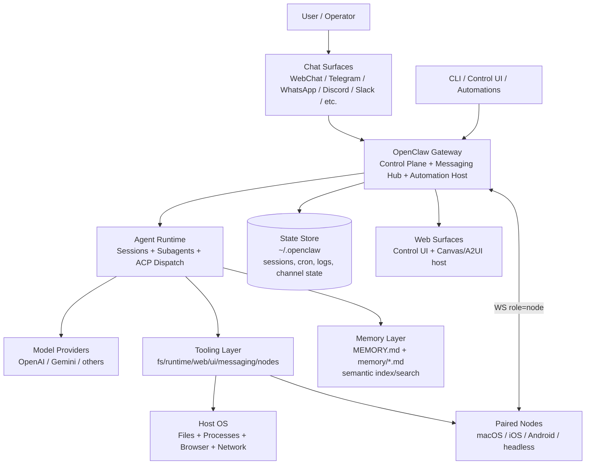
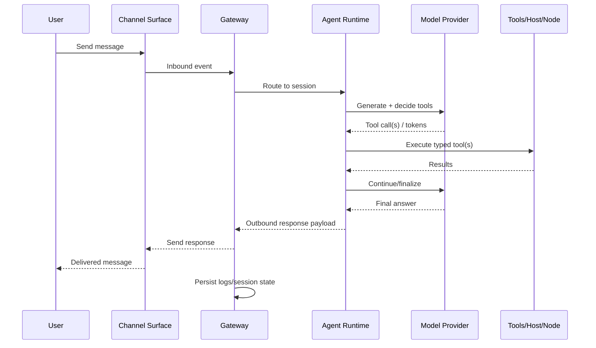
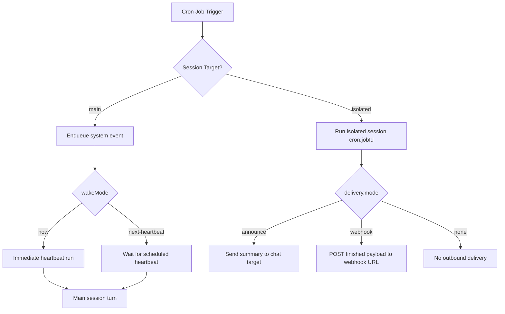
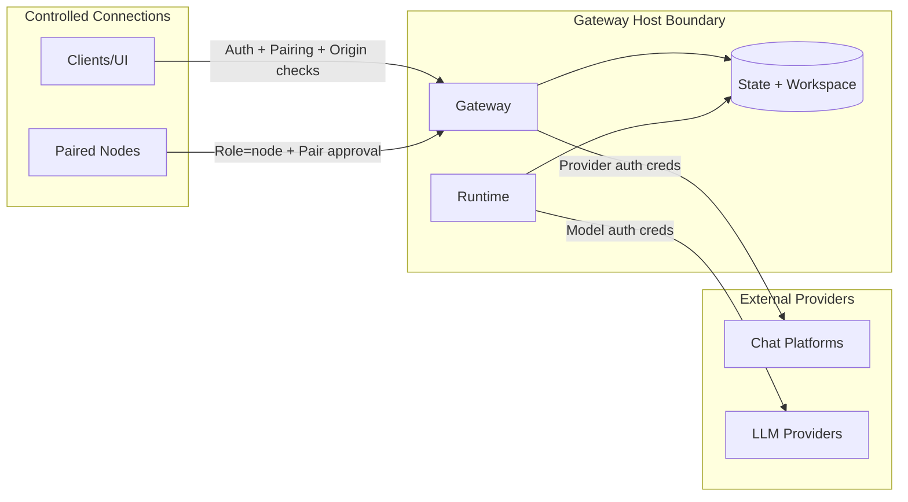

# OpenClaw Architecture — Visual Diagram

## System context (high-level)



## Component architecture (detailed)

```mermaid
flowchart LR
  subgraph Clients[Clients & Entry Points]
    CLI[OpenClaw CLI]
    UI[Control UI]
    WC[WebChat]
    CH[Channel Adapters\nWhatsApp/Telegram/Discord/etc.]
    HO[Hooks/Webhooks]
  end

  subgraph Gateway[Gateway (single long-running daemon)]
    WS[WebSocket Protocol\nconnect/req/res/event]
    AUTH[Auth + Pairing + Device Trust]
    ROUTE[Session Routing + Idempotency]
    EVT[Event Bus\nchat/agent/health/presence/cron]
    HTTP[HTTP Server\nUI + APIs + Canvas routes]
    AUTO[Automation Engine\nHeartbeat + Cron + Wakeups]
    CHM[Channel Manager\naccount/session ownership]
  end

  subgraph Runtime[Agent Runtime]
    SES[Session Manager\nmain/thread/isolated]
    ORCH[Orchestration\nsubagents + ACP runtime]
    TOOLSEL[Tool Policy\nallow/deny/profile/by-provider]
    EXEC[Turn Executor\nmodel loop + tool calling]
  end

  subgraph Tools[Tool Capability Plane]
    FS[FS Tools\nread/write/edit/apply_patch]
    RT[Runtime Tools\nexec/process]
    WEB[Web Tools\nweb_search/web_fetch]
    BRS[Browser/Canvas Tools]
    MSG[Message Tool]
    NOD[Nodes Tool]
    CRN[Cron/Gateway Tools]
    MEMT[Memory Tools\nmemory_search/memory_get]
  end

  subgraph Data[Persistence & Knowledge]
    ST[(Gateway State\nlogs, sessions, cron runs, channel state)]
    WM[(Workspace Files\nMEMORY.md + memory/*.md)]
    IDX[(Memory Index\nbuiltin or QMD)]
  end

  subgraph External[External Systems]
    LLM[Model Providers]
    OS[Host OS + Browser + Network]
    DEV[Paired Nodes]
    CHAT[External Chat Platforms]
  end

  CLI --> WS
  UI --> HTTP
  WC --> WS
  CH <--> CHM
  HO --> HTTP

  WS --> AUTH --> ROUTE --> SES
  ROUTE --> EVT
  AUTO --> EVT
  CHM --> EVT

  SES --> ORCH --> EXEC
  EXEC --> LLM
  EXEC --> TOOLSEL --> FS
  TOOLSEL --> RT
  TOOLSEL --> WEB
  TOOLSEL --> BRS
  TOOLSEL --> MSG
  TOOLSEL --> NOD
  TOOLSEL --> CRN
  TOOLSEL --> MEMT

  FS --> OS
  RT --> OS
  WEB --> OS
  BRS --> OS
  NOD --> DEV
  MSG --> CHAT
  CRN --> AUTO

  MEMT --> WM
  MEMT --> IDX
  AUTO --> ST
  EVT --> ST
  CHM --> ST
  SES --> ST

  CHM <--> CHAT
```

## End-to-end message flow



## Automation flow (cron + heartbeat)



## Security boundary map


